# Machine Learning GPU 사용 환경 구축


### 필자의 그래픽 사양 NVIDIA GEFORCE RTX 4050


## 컴퓨터 사양에 맞는 권장 버전 확인
- cmd창에 `nvidia-smi` 입력하여 CUDA 권장 버전 확인

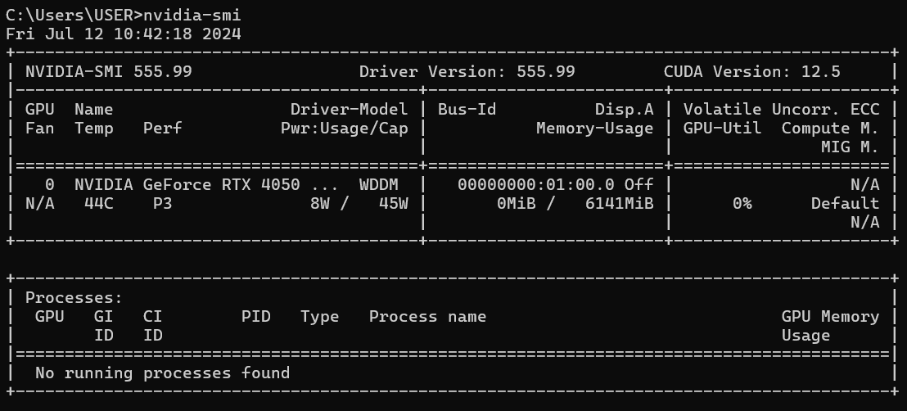

- CUDA 권장 Version: 12.5

## Compute Capability 확인
- 아래 사이트에서 CUDA 버전에 맞는 Compute capability 확인 가능

    ```
    https://developer.nvidia.com/cuda-gpus
    ```


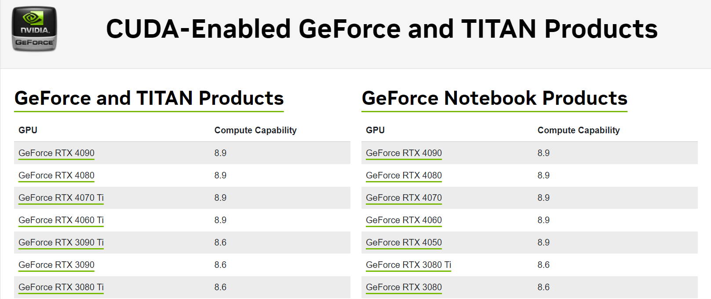

- Compute Capability - 8.9

## CUDA Toolkit Download
- 아래 사이트에서 사양에 맞는 버전 확인
- CUDA Toolkit 버전에 맞는 PyTorch 버전 확인 필요!

    **CUDA Toolkit 설치 사이트**

    https://developer.nvidia.com/cuda-toolkit-archive
    
    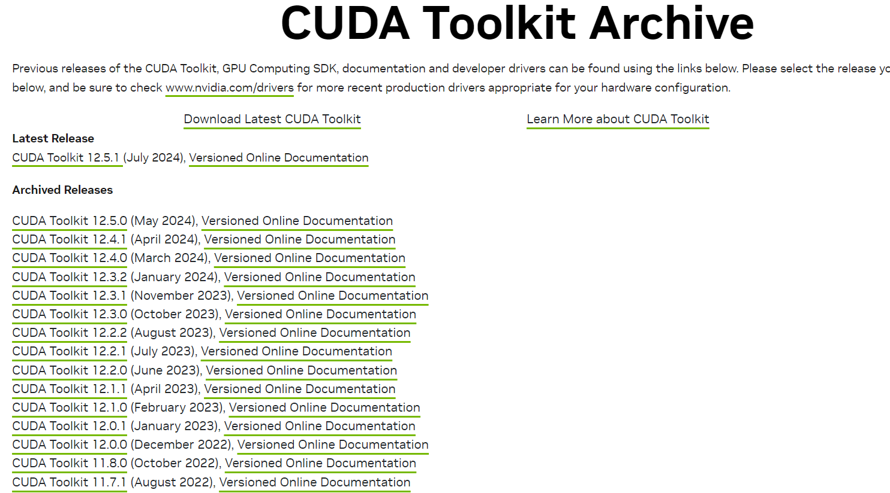

    **PyTorch Version 확인 사이트**

    https://pytorch.org/get-started/previous-versions/

    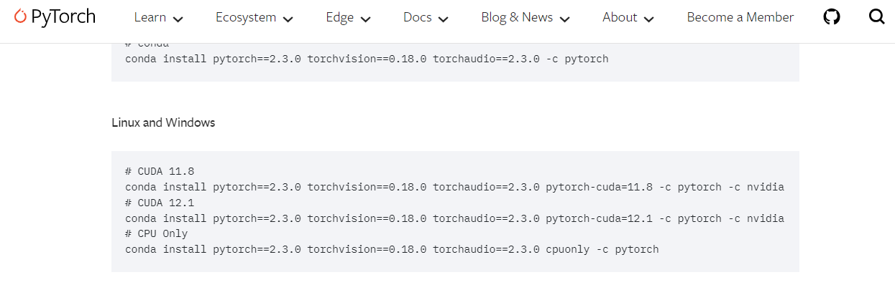

필자는 PyTorch에서 CUDA 12.5 연동되는 PyTorch 버전이 없어 11.8 버전 다운로드 받았다.

**설치 과정**

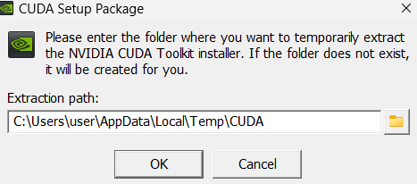

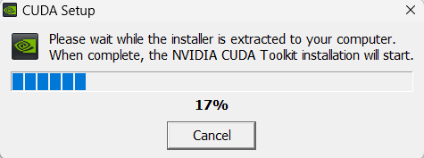


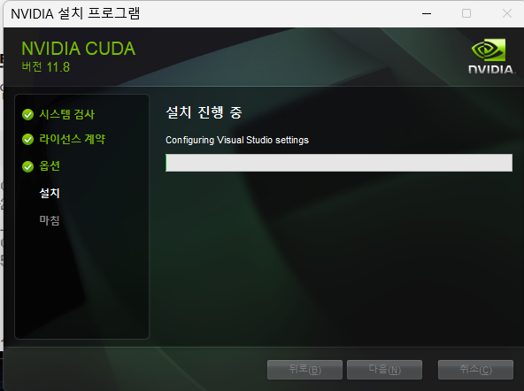

#### 설치 완료 후 환경변수를 확인해보면 자동으로 설정되어 있다.


## CUDA Version 확인
cmd창에서 `nvcc --version` 입력하여 출력창 제일 마지막 줄에서 cuda version 확인

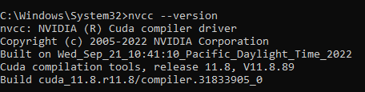


## cuDNN Download
- cuDNN(CUDA Deep Neural Network library)은 NVIDIA가 개발한 딥러닝을 위한 GPU 가속 라이브러리

**주요 기능 및 사용 사례**

```
- 딥러닝 연산 최적화: cuDNN은 주요 딥러닝 연산인 합성곱(convolution), 풀링(pooling), 정규화(normalization) 등을 GPU에서 최적화된 방식으로 처리

- 성능 향상: GPU 가속을 통해 딥러닝 작업의 처리 속도를 대폭 향상 (CPU에 비해 GPU는 병렬 처리 능력이 뛰어남)

- 딥러닝 프레임워크 지원:
  1. TensorFlow 
  2. PyTorch
  3. MXNet
  4. Caffe

- 최신 기술 지원: 지속적으로 cuDNN을 업데이트하여 최신 GPU 아키텍처 및 딥러닝 알고리즘에 대한 최적화를 제공
```

**cuDNN 설치 사이트**

https://developer.nvidia.com/rdp/cudnn-archive


1. 위 사이트 접속 후 NVIDIA Developer Program Membership 회원가입

2. CUDA 버전과 호환되는 cuDNN 다운
    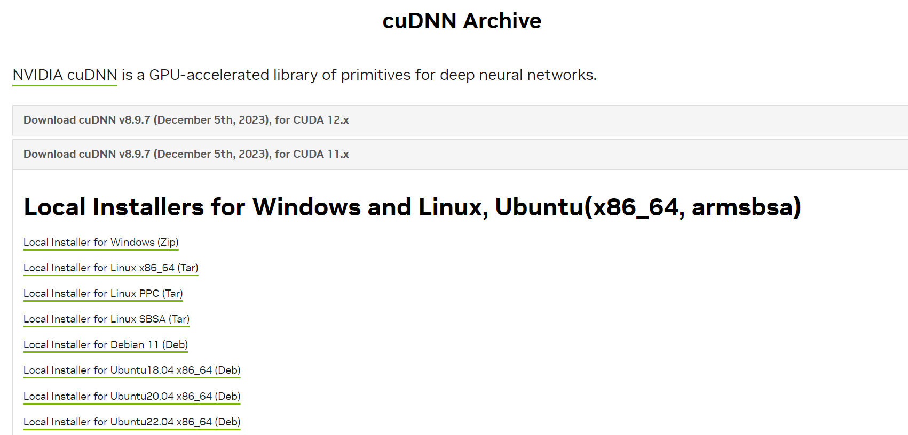

3. zip file 압출 풀기

4. bin, lib, include 폴더 복사
    

5. CUDA 설치되어 있는 경로에 붙여넣기
    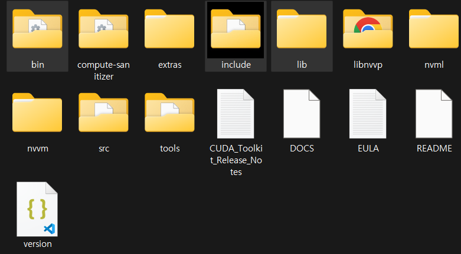

- **경로**
  
  C:\Program Files\NVIDIA GPU Computing Toolkit\CUDA\v11.8


## 확인

**Torch version**
```py
import torch

torch.__version__
```

**cuDNN 활성화 및 Version 확인**

```py
import torch
print(torch.backends.cudnn.enabled)
print(torch.backends.cudnn.version())
```

**아래 코드 실행 시 출력 정보와 동일하게 나오면 성공**
```py
import ultralytics
ultralytics.checks()
```
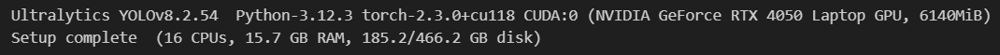